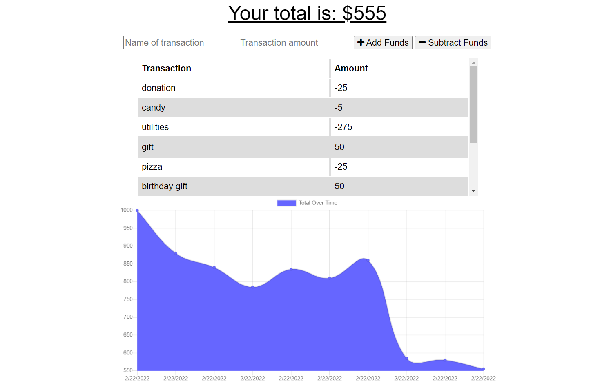

# Budget Tracker

## Purpose
To provide an app that allows a user to keep track of money transactions whether they are connected to a network or not.

This app utilizes IndexedDB to add offline functionality, and is a working Progressive Web Application (PWA).

## Built With
* JavaScript
* HTML
* CSS
* express.js
* Mongoose
* compression
* morgan
* Bootstrap

## Installation
From the CLI, type `npm install` to install the app dependencies, and then start the server with `node server.js`. Then open your browser to `localhost:3001`.

## Screenshot

## Deployed App Link
https://fast-everglades-53387.herokuapp.com